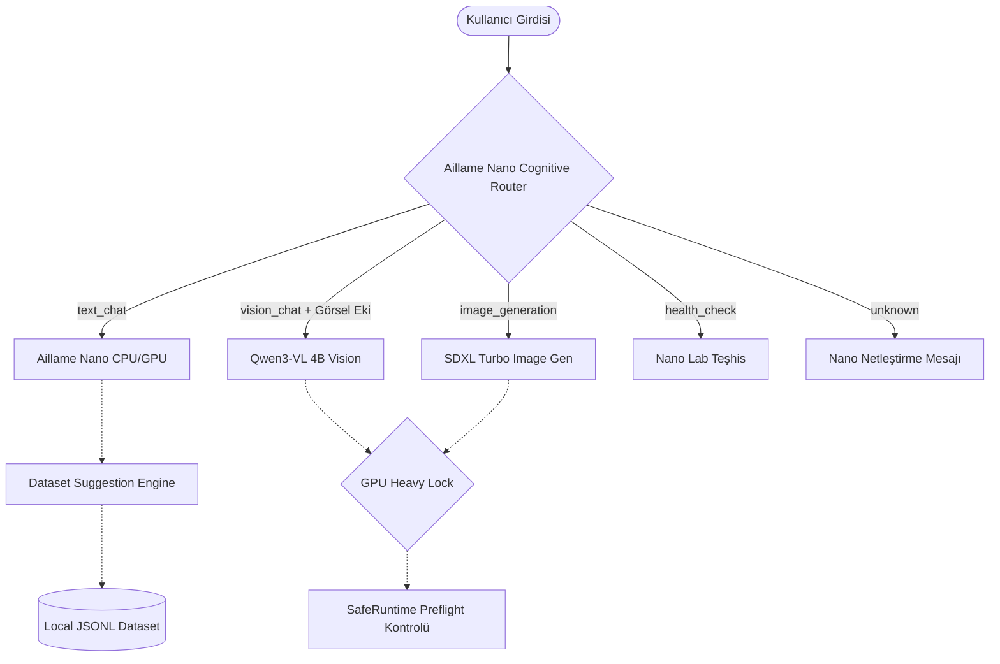

# Aillame Local AI Architecture Guide (Yerel Yapay Zeka Mimari Kılavuzu)

Bu doküman, **Aillame** masaüstü uygulamasının yerel yapay zeka (Local AI) mimarisini, model rollerini, akıllı bilişsel yönlendiricisini (Cognitive Router), güvenli çalışma zamanı (SafeRuntime) ve GPU Heavy Lock çakışma engelleme mekanizmalarını detaylandırmaktadır.

---

## 1. Mimariye Genel Bakış

Aillame, düşük bellekli (HP OMEN Laptop: Intel i7, 16 GB RAM, 6 GB VRAM NVIDIA RTX 4050 GPU) sistemlerde kararlı, hızlı ve güvenli çalışabilmek üzere tasarlanmış **Çoklu Yerel Uzman Model (Local Multi-Specialist Models)** mimarisini benimser. 

Ağır işlem yüklerini (Görsel Anlama/VLM ve Görsel Üretim/SDXL) aynı anda çalıştırmaktan kaçınmak için bir **Merkezi Beyin (Cognitive Router)** ve **GPU Heavy Lock** donanım koruma katmanı kullanılır.



---

## 2. Model Rolleri ve Dağılımı

### A) Aillame Nano (`aillame-nano-v1` / `aillame-nano-v2`)
*   **Rolü:** Ana Çekirdek / Metin Asistanı / Niyet Anlama / Akıllı Görev Yönlendirici (Cognitive Router).
*   **Görevi:** Standart metin tabanlı sohbetleri çözmek, kullanıcı komutlarındaki niyetleri (resim çizme, sağlık kontrolü vb.) stem-matching analiziyle yakalamak, belirsiz isteklerde netleştirme istemek.
*   **UI Yükleme Durumları:**
    *   `"Aillame Nano yanıt hazırlıyor"` (Sohbet)
    *   `"Aillame Nano isteği netleştiriyor"` (Belirsiz Giriş)
    *   `"Aillame Nano isteği sınıflandırıyor"` (Yönlendirme Kararı)
*   **İlgili Modül:** `src/core/nano-cognitive/service.ts`

### B) Qwen3-VL 4B Nano Vision (`qwen3-vl-4b-instruct-q4-k-m`)
*   **Rolü:** Göz (Visual Core) / Multimodal Görsel Analiz / OCR.
*   **Görevi:** Kullanıcı bir görsel ekiyle soru sorduğunda devreye girer. Görselleri yorumlar, metin/belge analizleri yapar.
*   **Model Dosya Yolları:**
    *   Model: `C:\Aillame\Models\nano\qwen3-vl-4b\model.gguf`
    *   Vision Projesi: `C:\Aillame\Models\nano\qwen3-vl-4b\mmproj.gguf`
*   **UI Yükleme Durumu:**
    *   `"Qwen3-VL 4B görseli analiz ediyor"` (Vision)
*   **İlgili Endpointler:**
    *   `GET /api/aillame/vision/health` (Teşhis/Sağlık Durumu)
    *   `POST /api/aillame/vision/mini-test` (Geliştirici mini görsel anlama testi)
    *   `POST /api/core/chat` (Multimodal interceptor katmanı)

### C) Stable Diffusion XL Turbo (`sdxl-turbo-1.0`)
*   **Rolü:** Görsel Üretici / Image Generation.
*   **Görevi:** Kullanıcının metinden görsel üretme isteklerini karşılar. Nano yönlendirici isteği algıladığında preflight kontrollerini ve GPU Heavy Lock durumunu sorgulayıp SDXL Turbo'ya asenkron iş ataması (handoff) gerçekleştirir.
*   **Model Dosya Yolları:**
    *   Hugging Face Hub / Diffusers Klasörü: `C:\aillame-models\diffusion\sdxl-turbo-1.0` veya `C:\aillame-models\diffusion\sd_xl_turbo_1.0_fp16.safetensors`
*   **UI Yükleme Durumu:**
    *   `"SDXL Turbo görsel üretimi hazırlanıyor"` (SDXL)
*   **İlgili Endpointler:**
    *   `POST /api/image-generation` (Genel iş sırası)
    *   `POST /api/aillame/v1/vision/generate` (Native C++ motoru çağrısı)
    *   `POST /api/image-generation?dryRun=true` (Geliştirici kilit/runtime testi)

### D) Nano Lab / Teşhis Paneli
*   **Rolü:** Sistem Sağlık Kontrolü / Donanım Kaynağı Analizi / Manuel Testler.
*   **UI Yükleme Durumu:**
    *   `"Nano Lab sağlık kontrolü hazırlanıyor"` (Sağlık/Health)

---

## 3. Akıllı Bilişsel Yönlendirme (Cognitive Routing) Kuralları

İstekler, Türkçe ek/takı çekimlerine duyarlı akıllı **Stem-Matching Regex** analizörü tarafından aşağıdaki öncelik sırasına göre taranır:

1.  **Görsel Ek Durumu (`vision_chat`):** İstekte `imageBase64` varsa, prompt içeriğine bakılmaksızın doğrudan **Qwen3-VL 4B** multimodal motoru tetiklenir.
2.  **Teşhis ve Sağlık Talepleri (`health_check`):** Prompt içerisinde `health`, `sağlık kontrolü`, `teşhis` gibi terimler varsa, ağır inference başlatılmadan doğrudan bilgilendirici sistem durum haritası döner.
3.  **Görsel Üretim (`image_generation`):** Stem eşleşmesi (*üret|oluştur|çiz|tasarla|yap* + *görsel|resim|logo|foto|manzara|portre|desen*) sağlandığı an kilit korumalı **SDXL Turbo** kuyruğuna handoff yapılır.
4.  **Belirsiz İstekler (`unknown`):** `...` gibi çok kısa, anlamsız veya boş girdilerde kullanıcıya asistan yönlendirme seçeneklerini ve detaylandırma taleplerini sunan şık bir netleştirme paneli sunulur.
5.  **Genel Sohbet (`text_chat`):** Kalan tüm girdiler hızlı yanıtlar veya yerel genel bilgi motoru için **Aillame Nano**'da çözülür.

---

## 4. SafeRuntime ve GPU Heavy Lock Mekanizmaları

HP OMEN Gaming laptopun donanım kaynaklarını (özellikle 6 GB VRAM) korumak amacıyla iki katmanlı bir emniyet ağı uygulanmıştır:

### 1. SafeRuntime (Preflight)
Ağır GPU işlemleri (VLM çalışması veya SDXL görsel üretimi) tetiklenmeden önce anlık `nvidia-smi` çağrısı ile RAM ve VRAM sorgulanır.
*   **SDXL Turbo Alt Limitleri:** Asgari **8000 MB RAM** ve **6500 MB Boş VRAM** gereklidir.
*   **Düşük Kaynak Profili (`low`):** Sistem kaynakları altındaysa preflight otomatik hata döner (`RAM yetersiz, işlem başlatılmadı`) ve donanımın çökmesi/kilitlenmesi engellenir.

### 2. GPU Heavy Lock (Singleton Lock)
NodeJS runtime üzerinde aynı anda **sadece tek bir ağır GPU işlemi** çalışabilir.
*   Kilit nesnesi `globalThis[Symbol.for('aillame.gpuHeavyLock')]` üzerinde tutulur.
*   Bir işlem (örn. `sdxl-turbo` veya `qwen-vlm`) kilidi aldığında, diğer tüm ağır işlemler sıraya girmeden anında reddedilir ve kullanıcı dostu bir kilit çakışması hatası verilir.
*   Kilitlerin serbest bırakılması asenkron/senkron tüm yollarda `finally` bloğuyla garantiye alınmıştır.

---

## 5. Silinen ve Kullanılmayan Legacy Modeller

Aşağıdaki modeller sistem temizliği ve sadeleştirme fazları kapsamında **kapsam dışı bırakılmış veya kalıcı olarak silinmiştir**. Bu modellerin runtime tanımları, UI listeleri veya fallback yolları olarak tekrar eklenmemesi / çağrılmaması **kritik öneme sahiptir**:
*   `Qwen3-VL 8B` (VRAM sınırları nedeniyle çıkarıldı)
*   `Gemma 4 26B` (Kaynak yetersizliği nedeniyle kaldırıldı)
*   `Gemma E4B` (Tedarik dışı)
*   `Ollama Qwen 3.5 (4B/9B)` (Yerel bağımlılıkları azaltmak için kaldırıldı)
*   `Qwen2.5 0.5B Instruct` (Legacy test modeli, kalıcı olarak temizlendi)

---

## 6. Geliştirici Test ve Doğrulama Komutları

Yerel geliştirmeleri, mimari kararlılığı ve entegrasyonu onaylamak için aşağıdaki test adımları sırayla izlenmelidir:

```bash
# 1. TypeScript Tip Kontrolü
npm run typecheck

# 2. Next.js Üretim Derlemesi
npm run build

# 3. Görsel Sağlık Kontrolü Endpoint Testi
curl http://localhost:3000/api/aillame/vision/health

# 4. Multimodal Mini-Test Teşhis Çağrısı
curl -X POST -H "Content-Type: application/json" -d "{\"dryRun\": true}" http://localhost:3000/api/aillame/vision/mini-test

# 5. SDXL Güvenli Çalışma / Kilit Testi (Dry-run)
curl -X POST -H "Content-Type: application/json" http://localhost:3000/api/image-generation?dryRun=true

# 6. Aktif Model Listesi Doğrulaması
curl http://localhost:3000/api/models
```

---

## 7. Geliştirme Notları & Riskler
*   **İşletim Sistemi:** Windows (PowerShell & CMD uyumlu CLI araçları).
*   **VRAM Sınırı:** NVIDIA GeForce RTX 4050 Laptop GPU (6 GB VRAM sınırları dar olduğundan, preflight limitleri değiştirilmemeli veya bypass edilmemelidir).
*   **Registry Yapısı:** `src/core/models/capability-registry.ts` dosyası, aktif `nano.multimodal.core` ve `vision.review` yeteneklerinin birincil adresi olarak `qwen3-vl-4b-instruct-q4-k-m` modelini kaydetmektedir.

---

## 8. Hafıza ve Bağlam Yönetimi (Memory & Context Management)

Aillame Nano, kullanıcı etkileşimlerinden elde ettiği bilgileri, özel yönergeleri ve tercihleri yerel bir bağlam deposunda saklayarak gelecek sohbet oturumlarında daha kişisel ve tutarlı yanıtlar verir.

### Mimari İlkeler ve Kurallar:
*   **Fine-Tuning Değildir:** Hafıza sistemi, modellerin ağırlıklarını değiştiren (fine-tuning/distillation) ağır bir işlem değildir. Dynamic Context Injection (Dinamik Prompt Enjeksiyonu) yöntemini kullanır.
*   **Otomatik Kayıt Yapılmaz:** Hassas verilerin korunması ve kullanıcı kontrolünün elinde olması için sistem, kullanıcının bilgisi ve onayı olmadan kalıcı hafızaya otomatik kayıt (`auto-save`) yapmaz. Kullanıcının manuel onaylaması veya eklemesi gerekir.
*   **Yerel JSON Deposu (Local JSON Store):** Tüm hafıza kartları `.aillame-data/stores/aillame-memory.json` dosyası üzerinde, tamamen yerel olarak saklanır. Hiçbir bilgi harici buluta veya sunuculara aktarılmaz.
*   **Hassas Veri Koruması (Security Shield):** API Token'ları, şifreler, özel dosya yolları, kredi kartı bilgileri veya T.C. Kimlik numaraları gibi hassas ve gizli bilgiler, regex tabanlı süzgeçlerle taranarak hafızaya eklenmesi engellenir.
*   **En Alakalı 3 Hafıza Kaydı:** Aillame Nano ile yapılan her sohbet sorgusunda promptun niyetine ve kelime benzerliğine göre skorlama yapılır. En alakalı en fazla **3 hafıza kaydı** sistem yönergesi olarak prompt bağlamına dinamik olarak eklenir.
*   **Hata Toleransı (Resilience):** Hafıza dosyasının bozulması veya okuma/yazma hatası verilmesi durumunda, chat akışı hiçbir şekilde kesilmez; sistem hafızayı es geçip normal sohbeti kararlılıkla sürdürür. Bozuk JSON tespiti halinde veritabanı kendini otomatik yedekleyip temiz bir şekilde yeniden başlatır (Self-Healing).

---

## 9. Workspace Context (Proje Bağlamı) Sistemi

Faz 8 kapsamında Aillame Nano, kullanıcının farklı projeleri ve çalışma alanları için özel bağlamlar tanımlamasına ve bu bağlamlar arasında dinamik geçiş yapmasına imkan tanıyan **Workspace Context** sistemine kavuşmuştur.

### Mimari İlkeler ve Kurallar:
*   **İzole Proje Tanımları:** Kullanıcının geliştirdiği web sitesi, uygulama veya içerik portalları için ayrı hedefler, yazım dilleri, iletişim tonları ve SEO gereksinimleri yerel bir JSON dosyası olan `.aillame-data/stores/aillame-projects.json` içinde saklanır.
*   **Aktif Proje Seçimi:** `.aillame-data/stores/aillame-active-project.json` içinde o an aktif olan proje ID'si barındırılır.

---

## 10. Yerel Distillation Dataset Veri Toplama Sistemi

Faz 9 kapsamında Aillame Nano, gelecekte ince ayar (fine-tuning) ve distillation döngüleriyle yeteneklerini (Türkçe yanıt kalitesi, bilişsel yönlendirme doğruluğu, güvenli araç kullanımı) geliştirebilmesi için **güvenli, kullanıcı denetimli yerel veri toplama altyapısına** kavuşmuştur.

### Mimari İlkeler ve Kurallar:
*   **Eğitim/İnce Ayar Başlatılmaz:** Bu sistem model eğitimi veya fine-tuning yapmaz. Yalnızca yerel cihazda, kullanıcı denetiminde temiz ve yapılandırılmış JSONL veri örnekleri derler.
*   **Tamamen Yerel Depolama:** Tüm veri seti `.aillame-data/stores/aillame-distillation-dataset.jsonl` dosyasında saklanır. Bulut gönderimi veya veri sızıntısı kesinlikle yoktur.
*   **Hassas Veri Maskeleme:** Kredi kartı, şifre, token ve e-posta gibi hassas bilgiler regex süzgeçleriyle otomatik olarak sansürlenir (`[REDACTED_API_KEY]`, `[REDACTED_CARD]`).
*   **Kullanıcı Onayı Zorunluluğu:** Kullanıcı onayı (`userApproved: true`) olmadan veri setine kalıcı kayıt yapılmaz.
*   **Safe Read-Only Tools:** `distillation.stats`, `distillation.search` ve `distillation.list` araçlarıyla chat içerisinden veri setine dair güvenli analizler yapılabilir.
*   **Otomatik Prompt Enjeksiyonu:** Aktif bir proje seçildiğinde, Nano inference öncesi prompt'un en altına projenin tüm tercihleri (kelime limiti, başlık yapısı, ton vb.) otomatik enjekte edilerek model çıktılarının bu kurallara %100 uyması sağlanır.
*   **Hafıza Sistemi ile Sinerji:** Proje bağlamı ile genel hafıza sistemi birlikte çalışır. En fazla 1 aktif proje bağlamı + en fazla 3 genel hafıza kaydı prompt'a dinamik olarak eklenir.
*   **Güvenli Araç Bindirmeleri:** `project.list`, `project.active` ve `project.search` araçları sayesinde Nano, sohbet içinden projelerle ilgili soruları safe/read-only olarak yanıtlayabilir. Destruktif (silme/taşıma) hiçbir işlem yetkilendirilmez.
