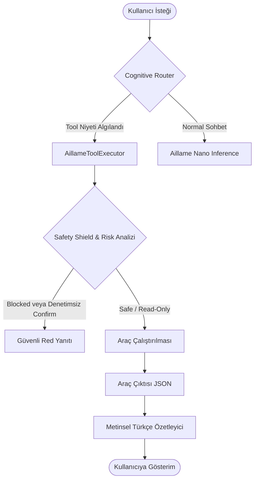

# Aillame Yerel Güvenli Araç Kullanım Sistemi Belgesi (Local Safe Tool-Use)

Bu doküman, Aillame Nano'nun Faz 7 kapsamında hayata geçirilen **Yerel Güvenli Araç Kullanımı (Safe Tool-Use & Function Calling)** altyapısının teknik mimarisini, güvenlik politikalarını, API sözleşmelerini ve çalışma ilkelerini açıklamaktadır.

---

## 1. Mimari Genel Bakış

Aillame Nano, yerel sistem üzerinde çalışan ve dış dünya ile doğrudan bağlantısı olmayan bağımsız bir yapay zeka asistanıdır. Ancak, kullanıcının sorularını yanıtlamak ve proje bağlamına hâkim olmak için sistem teşhisi, yerel hafıza yönetimi ve dosya analiz araçlarına ihtiyaç duyar.

Bu sistemin en kritik gereksinimi **Güvenlik Sınırlarıdır (Security Boundaries)**. Aillame Nano hiçbir koşulda kullanıcının haberi olmadan veya denetimsiz olarak tehlikeli terminal komutları (örn: dosya silme, disk biçimlendirme) çalıştıramaz.

### Araç Kullanım Akışı (Function Calling Pipeline)


---

## 2. Risk Seviyeleri ve Güvenlik Politikaları

Tüm araçlar, çalıştırılmadan önce merkezi bir risk denetiminden geçer. Aillame Nano'da üç temel risk seviyesi tanımlanmıştır:

| Risk Seviyesi | Tanım | Örnek Araçlar | Davranış Politikası |
| :--- | :--- | :--- | :--- |
| **`safe`** | Sisteme zarar vermeyen, read-only bilgi toplama araçları. | `system.health`, `models.status`, `memory.search`, `project.docs` | Doğrudan çalıştırılır ve sonuç kullanıcıya Türkçe özetlenir. |
| **`confirm_required`** | Disk üzerinde değişiklik yapan veya hassas veri okuyabilen araçlar. | `memory.delete`, `project.analyze` | MVP aşamasında otomatik çalıştırılamaz; kullanıcı onayı istenir. |
| **`blocked`** | Serbest terminal erişimi sağlayan veya tehlikeli sistem komutları. | `system.execute_command`, `file.delete_all` | Kalıcı olarak engellenmiştir, tetiklendiğinde anında kesilir. |

---

## 3. Sistemde Kayıtlı Güvenli Araçlar

Faz 7 kapsamında kullanıma sunulan **5 adet safe MVP araç** şunlardır:

### 1. `memory.search`
- **Görev:** Yerel asistan hafızasında anahtar kelime veya semantik sorgu yapar.
- **Parametreler:** `{ query: string }`
- **Dönen Veri:** Eşleşen hafıza kayıtları listesi.

### 2. `memory.list`
- **Görev:** Yerel hafızadaki tüm kayıtlı kullanıcı ve proje tercihlerini listeler.
- **Parametreler:** `{}`
- **Dönen Veri:** Tüm hafıza kayıtları.

### 3. `system.health`
- **Görev:** İşletim sistemi platformunu, Node.js sürümünü ve GPU Heavy Lock durumunu sorgular.
- **Parametreler:** `{}`
- **Dönen Veri:** Sağlık verileri JSON.

### 4. `models.status`
- **Görev:** Sistemdeki aktif, inaktif ve silinen (kaldırılan) AI modellerinin hazır olma durumunu sorgular.
- **Parametreler:** `{}`
- **Dönen Veri:** Model durum tablosu.

### 5. `project.docs`
- **Görev:** Projedeki kritik yerel AI mimari dokümanlarının varlığını ve boyutunu denetler.
- **Parametreler:** `{}`
- **Dönen Veri:** Doküman listesi.

---

## 4. API ve Endpoint Sözleşmesi

Yerel araçların bağımsız istemciler veya frontend tarafından tetiklenebilmesi için RESTful API yolu kurulmuştur.

### **POST /api/aillame/tools/run**
- **İstek Gövdesi (Request Body):**
  ```json
  {
    "toolId": "system.health",
    "input": {}
  }
  ```
- **Yanıt Gövdesi (Response Body - Başarılı):**
  ```json
  {
    "ok": true,
    "data": {
      "gpuHeavyLock": "unlocked",
      "platform": "win32",
      "nodeVersion": "v24.15.0",
      "status": "healthy"
    },
    "message": "Sistem tamamen sağlıklı ve yeni görevler için hazır.",
    "toolId": "system.health",
    "riskLevel": "safe"
  }
  ```

---

## 5. Merkezi Güvenlik Kalkanı (Safety Shield)

Aillame Nano chat endpoint'i, prompt injection veya kötü niyetli komut çalıştırma girişimlerini engellemek için **Merkezi Güvenlik Kalkanı (Central Safety Shield)** ile korunmaktadır.

### Engellenen Kalıplar ve Kelimeler (Blocked Keywords)
Sorgu içinde aşağıdaki kelimeler veya türevleri geçtiğinde sistem otomatik olarak işlemi engeller ve kullanıcıya Türkçe açıklayıcı bir güvenlik uyarısı döner:
- Hassas veri sızıntısı: `env`, `.env`, `token`, `api_key`, `şifre`, `password`, `secret`
- Tehlikeli dosya/sistem işlemleri: `rm -rf`, `rmdir`, `delete`, `format`, `del`
- Yetkisiz kabuk/komut erişimi: `powershell`, `cmd`, `shell`, `bash`, `exec`, `sudo`

### Güvenlik İhlal Yanıtı (Rejection Payload)
```json
{
  "response": "**Güvenlik Engeli:** Aillame Nano, yerel sistem güvenliği gereği serbest kabuk (shell) komutları çalıştırma, sistem dosyalarına erişme veya hassas credential/token bilgilerini ifşa etme yetkisine sahip değildir. Bu işlem güvenlik politikalarımız nedeniyle kalıcı olarak engellenmiştir.",
  "modelId": "aillame-nano-v1-tool-blocked",
  "provider": "aillame-nano",
  "runtime": "nano-tool-security-guard"
}
```

---

## 6. Doğrulama ve Test Regresyonu

Sistemin kararlılığı, `scripts/smoke-phase7-tool-use-validation.ts` regresyon testi ile doğrulanmaktadır. Bu test:
1. RESTful API üzerinden kayıtlı tüm araçları (`system.health`, `models.status`, etc.) çağırır ve dönen JSON verilerini doğrular.
2. Bilinmeyen veya yetkisiz araç tetiklemelerinin reddedildiğini kontrol eder.
3. Bilişsel yönlendiricinin (Cognitive Router) niyetleri doğru araca yönlendirdiğini doğrular.
4. E2E sohbet akışında güvenli araçların tetiklenip Türkçe doğal özet döndüğünü kontrol eder.
5. Prompt enjeksiyonu ve tehlikeli kelime içeren 3 farklı senaryoda güvenlik kalkanının başarıyla devreye girdiğini garanti eder.
