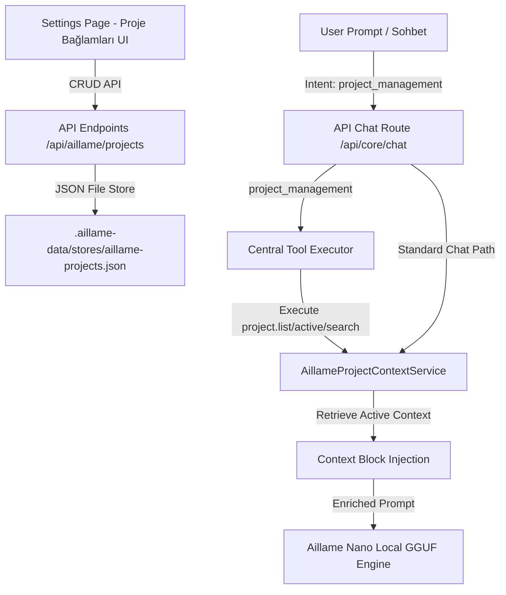

# Aillame Nano Workspace Context & Proje Bağlamı Mimarisi

Bu doküman, Aillame projesi Faz 8 kapsamında geliştirilen **Proje Bağlamı (Workspace Context)** altyapısının teknik detaylarını, veri modellerini, API entegrasyonlarını ve kullanıcı arayüzünü (UI) açıklamaktadır.

---

## 🚀 Genel Mimari Genel Bakış

Aillame, yerel bir AI asistanı olarak kullanıcının çalıştığı projeyi veya sektörü (örn: Psikoloji sitesi, Hukuk portalı, Sosyal Medya içerik üretimi) algılayabilmeli ve bu bağlama uygun kararlar alıp çıktılar üretebilmelidir. Faz 8 ile Aillame Nano, tamamen güvenli, yerel ve izole bir **Workspace Context** mimarisine kavuşmuştur.



---

## 📁 1. Veri Modeli & Yerel Depolama

Proje bağlamları, tamamen yerel ve taşınabilir olması amacıyla `.aillame-data/stores/aillame-projects.json` ve `aillame-active-project.json` dosyalarında şifresiz, güvenli JSON formatında saklanır.

### Veri Arayüzü (`src/core/projects/types.ts`)
```typescript
export interface ProjectSeoPreferences {
  enabled: boolean;
  minWords?: number;
  headings?: boolean;      // H1, H2, H3 kullanımı
  metaDescription?: boolean; // Meta açıklaması üretimi
}

export interface AillameProjectContext {
  id: string;              // Benzersiz slug (örn: hukuk-sitesi)
  name: string;            // Okunabilir ad (örn: Hukuk Sitesi)
  description?: string;    // Proje amacı ve detayları
  category: 'website' | 'software' | 'content' | 'legal' | 'psychology' | 'social' | 'other';
  goals?: string[];        // Projenin ana hedefleri
  tone?: string;           // Yazım dili üslubu (örn: resmi, samimi)
  language?: string;       // Varsayılan dil (örn: tr, en)
  seoPreferences?: ProjectSeoPreferences;
  linkedMemoryTags?: string[]; // İlişkili hafıza etiketleri
  createdAt: string;
  updatedAt: string;
}
```

---

## ⚙️ 2. Merkezi Servis Sınıfı (`src/core/projects/project-context.service.ts`)

Servis sınıfı, projelerin kaydedilmesi, silinmesi, aranması ve aktif bağlamın yönetilmesini tamamen izole, asenkron ve güvenli bir şekilde koordine eder:

- **`getAllProjects()`**: JSON deposunu okur ve tüm projeleri listeler.
- **`saveProject()`**: Yeni proje kaydeder veya günceller.
- **`deleteProject()`**: Proje bağlamını kaldırır.
- **`getActiveProject()`**: Seçili olan aktif proje bağlamı bilgilerini döner.
- **`setActiveProject()`**: Aktif proje kimliğini kaydeder veya temizler.
- **`getProjectContextForPrompt()`**: Nano LLM inference öncesi prompt'a otomatik enjekte edilecek bağlam metnini hazırlar.

---

## 🛠️ 3. Güvenli Yerel Araç Kullanımı (Tool-Use Entegrasyonu)

Aillame Nano'nun yerel araçları güvenli bir şekilde çağırabilmesi için **3 adet yeni yerel araç** kaydedilmiştir:

1. **`project.list`**: Kayıtlı tüm proje bağlamlarını listeler.
2. **`project.active`**: Şu anda seçili olan aktif proje bağlamı bilgilerini döner.
3. **`project.search`**: Belirli anahtar kelimelere göre proje bağlamlarında arama yapar.

### Nano Bilişsel Yönlendirme (Cognitive Router)
Nano, sohbet esnasında kullanıcının niyetini (`intent`) analiz eder. Eğer kullanıcı projeleriyle ilgili bir soru sorarsa (örn: *"Hangi projelerim var?"*, *"Aktif projemi göster"*, *"Projelerimde ara"*):
- Niyet `project_management` olarak sınıflandırılır.
- İlgili yerel araç (`project.list`, `project.active` veya `project.search`) tetiklenir.
- Sonuçlar Türkçe doğal dil yorumuyla kullanıcıya sunulur.

---

## 🧠 4. Prompt Bağlamı Enjeksiyonu (Context Prompt Injection)

Nano ile normal sohbet ederken, eğer **aktif bir proje bağlamı** seçilmişse, servis LLM inference öncesinde prompt'un en altına otomatik olarak aşağıdaki gibi bir **aktif bağlam bloğu** enjekte eder:

```markdown
[AKTİF ÇALIŞMA ALANI BAĞLAMI - Sadece yerel olarak saklanan proje tercihleri]:
Proje: Hukuk Sitesi (Kategori: legal - Dil: TR)
İletişim Tonu: resmi, güven veren
Proje Hedefleri:
- Hukuki terimleri sade açıklamak
- Güven veren içerikler sunmak
SEO Gereksinimleri:
- Min Kelime: 300
- Başlık Yapısı (H1-H3): Evet
- Meta Açıklaması: Evet
```

Bu sayede Aillame Nano, harici bir şey belirtmenize gerek kalmadan, doğrudan seçili olan projenizin hedeflerine ve üslubuna uygun profesyonel yanıtlar üretir.

---

## 🎨 5. Premium Glassmorphic UI Paneli (`settings/page.tsx`)

Ayarlar ekranında tamamen Next.js & Tailwind CSS uyumlu, son derece premium bir **Proje Bağlamları** yönetim sekmesi oluşturulmuştur:

- **Sol Sütun (Yeni Bağlam Ekle)**: Proje ID, adı, açıklaması, kategori ve dil seçimleri, üslup tonu, proje hedefi ve açılır-kapanır gelişmiş **SEO Tercihleri** içeren cam morfizmli form yapısı.
- **Sağ Sütun (Tanımlı Bağlamlar & Arama)**: Canlı arama barı, aktif olan projeyi belirten yeşil neon parıltılı glowing badge, hızlı aktif yapma/temizleme butonu ve güvenli onay (confirm) mekanizmalı kaldırma butonu.

---

## 🔒 Güvenlik Beyanı

Aillame'in yerel felsefesine uygun olarak, proje bağlamı verileri **hiçbir şekilde buluta, uzak sunuculara veya üçüncü şahıs API'lerine gönderilmez.** Her şey tamamen HP OMEN laptopunuzun yerel diskinde barındırılır.
